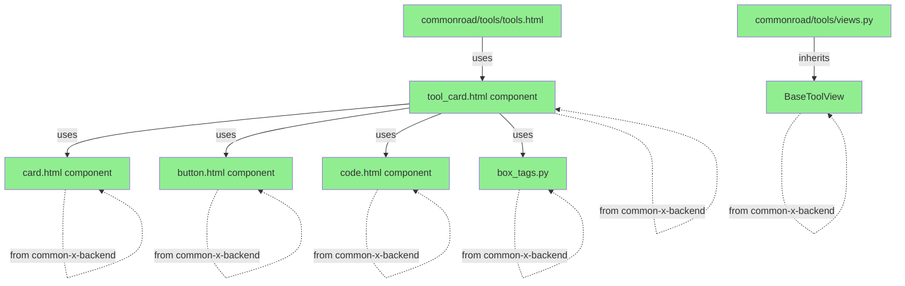
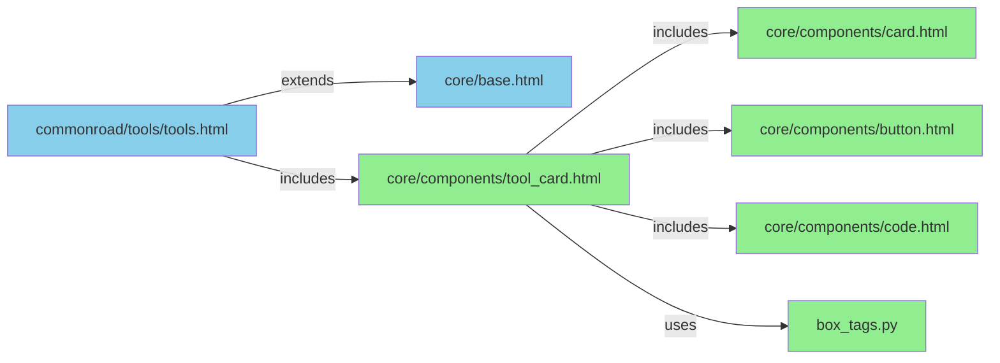

# Common-X-Backend Comparison: Current vs Tools Requirements

## Summary

**Conclusion:** **NO branch needed on common-x-backend.** The current common-x-backend (commit `0a36cc8f28284580ab3247a80749bb4cd99941a5`) contains ALL required components for the tools feature.

---

## 1. Dependency Analysis

### Current commonroad Setup
**File:** [`pyproject.toml`](../commonroad/pyproject.toml:17)

```toml
[tool.uv.sources]
commonx = { git = "https://gitlab.lrz.de/commonroadwebdev/common-x/common-x-backend", rev = "0a36cc8f28284580ab3247a80749bb4cd99941a5" }
```

- **Version:** `commonx==0.1.3`
- **Commit:** `0a36cc8f28284580ab3247a80749bb4cd99941a5`
- **Repository:** `https://gitlab.lrz.de/commonroadwebdev/common-x/common-x-backend`

### Package Data Configuration
**File:** [`common-x-backend/pyproject.toml`](../common-x-backend/pyproject.toml:21)

```toml
[tool.setuptools.package-data]
commonx = ["scenarios/templates/**/*", "tools/templates/**/*", "core/templates/**/*"]
```

This ensures all templates are included in the package:
- ✅ `scenarios/templates/**/*`
- ✅ `tools/templates/**/*`
- ✅ `core/templates/**/*`

---

## 2. Required Components vs Available Components

### 2.1 BaseToolView

**Required by:** [`commonroad/tools/views.py`](../commonroad/commonroad/tools/views.py:1)

```python
from commonx.tools.views import BaseToolView

class ToolView(BaseToolView):
    ...
```

**Available in:** [`common-x-backend/commonx/tools/views.py`](../common-x-backend/commonx/tools/views.py:4)

```python
from django.views.generic import TemplateView


class BaseToolView(TemplateView):
    template_name = "tools/tools.html"
```

✅ **STATUS: AVAILABLE**

---

### 2.2 tool_card.html Component

**Required by:** [`commonroad/templates/commonroad/tools/tools.html`](../commonroad/commonroad/templates/commonroad/tools/tools.html:16)

```django

```

**Available in:** [`common-x-backend/commonx/core/templates/core/components/tool_card.html`](../common-x-backend/commonx/core/templates/core/components/tool_card.html)

```django



<div class="space-y-8" id="{{ tool.href|slugify }}">
    {# Header Section #}
    <header class="space-y-3">
        
        <p class="uppercase tracking-wide text-sm text-primary/70">{{ tool.parent_group }}</p>
        
        <h2 class="text-3xl font-semibold">{{ tool.title }}</h2>
        <p class="text-base-content/80">{{ tool.text }}</p>
    </header>

    {# Tutorials Grid #}
    
    <div class="grid grid-cols-1 md:grid-cols-2 gap-4">
        
        
        
    </div>
    

    {# Action Buttons #}
    
    <div class="flex flex-wrap gap-4">
        
        
        
    </div>
    

    {# Install Command #}
    
    
    

    {# Example Code #}
    
    <div class="space-y-4">
        <h3 class="text-lg font-semibold">Example</h3>
        
    </div>
    

</div>

```

✅ **STATUS: AVAILABLE**

---

### 2.3 card.html Component

**Required by:** [`tool_card.html`](../common-x-backend/commonx/core/templates/core/components/tool_card.html:24)

```django

```

**Available in:** [`common-x-backend/commonx/core/templates/core/components/card.html`](../common-x-backend/commonx/core/templates/core/components/card.html)

```django
<a href="{{ card_href|default:'https://commonroad.in.tum.de/getting-started' }}"
   target="{{ card_target|default:'_self' }}"
   rel="noopener noreferrer"
   class="group block rounded-2xl border border-base-300 bg-base-100/70 p-6 shadow-md transition hover:-translate-y-1 hover:shadow-xl focus:outline-none focus:ring-2 focus:ring-primary/60">
    <p class="text-xs font-semibold uppercase tracking-[0.3em] text-primary/70">{{ card_badge|default:"Featured" }}</p>
    <div class="mt-3 flex items-start justify-between gap-6">
        <div>
            <h3 class="text-xl font-semibold text-base-content">{{ card_title|default:"Explore CommonRoad" }}</h3>
            
            <p class="mt-2 text-sm leading-relaxed text-base-content/70">{{ card_description }}</p>
            
        </div>
        <span class="shrink-0 text-2xl text-primary transition-transform group-hover:translate-x-1">{{ card_icon|default:"↗" }}</span>
    </div>
    <p class="mt-4 text-xs font-semibold uppercase tracking-wide text-primary">{{ card_cta|default:"Visit site" }}</p>
</a>
```

✅ **STATUS: AVAILABLE**

---

### 2.4 button.html Component

**Required by:** [`tool_card.html`](../common-x-backend/commonx/core/templates/core/components/tool_card.html:33)

```django

```

**Available in:** [`common-x-backend/commonx/core/templates/core/components/button.html`](../common-x-backend/commonx/core/templates/core/components/button.html)

```django
<a href="{{ href|default:'#' }}" target="{{ target|default:'_self' }}" rel="noopener noreferrer"
   class="btn {{ color|default:'btn-primary' }} {{ width|default:'min-w-[11rem]' }} {{ height|default:'min-h-[3rem]' }} {{ extra_class|default:'' }} font-semibold tracking-wide shadow-md hover:-translate-y-0.5 hover:shadow-lg transition duration-150 ease-out">
    
        <span class="text-lg">{{ icon }}</span>
    
    <span>{{ text|default:'Learn more' }}</span>
</a>
```

✅ **STATUS: AVAILABLE**

---

### 2.5 code.html Component

**Required by:** [`tool_card.html`](../common-x-backend/commonx/core/templates/core/components/tool_card.html:40,47)

```django


```

**Available in:** [`common-x-backend/commonx/core/templates/core/components/code.html`](../common-x-backend/commonx/core/templates/core/components/code.html)

```django
<div class="rounded-2xl border border-base-300 shadow-lg overflow-hidden" data-code-block">
    <div class="bg-base-200 px-4 py-2 flex items-center justify-between text-[0.7rem] uppercase tracking-[0.3em] text-base-content/70">
        <span class="font-semibold">{{ label|default:"In [1]:" }}</span>
        <button type="button"
            class="cr-copy-button text-[0.7rem] font-semibold tracking-wider uppercase inline-flex items-center gap-1"
            aria-label="Copy code"
            onclick="const block=this.closest('[data-code-block]');if(!block)return;const code=block.querySelector('code');if(!code)return;const originalLabel=this.dataset.originalLabel||this.textContent.trim();this.dataset.originalLabel=originalLabel;if(this._crCopyTimeout){clearTimeout(this._crCopyTimeout);}navigator.clipboard.writeText(code.textContent).then(()=>{this.textContent='Copied';this.classList.add('cr-copy-button--active');this._crCopyTimeout=setTimeout(()=>{this.textContent=this.dataset.originalLabel;this.classList.remove('cr-copy-button--active');this._crCopyTimeout=null;},1500);});">
            Copy
        </button>
    </div>
    <div class="bg-[#202124]">
        <div class="flex items-center justify-between px-4 py-3 border-b border-[#2D2F31] text-xs text-[#9AA0A6] uppercase tracking-wide">
            <span class="inline-flex items-center gap-2">
                <span class="h-2 w-2 rounded-full bg-[#34A853]"></span>
                {{ runtime|default:"Python 3" }}
            </span>
            <span class="font-semibold {{ accent|default:'text-[#AECBFA]' }}">{{ language|default:"Python" }}</span>
        </div>
        <pre class="px-4 py-4 overflow-x-auto leading-relaxed">
<code class="block font-mono text-sm text-[#E8EAED] whitespace-pre" data-language="{{ language|default:"python"|lower }}">{{ code|default:"print('Hello, CommonRoad!')"|escape }}</code>
        </pre>
    </div>
</div>
<script>
(function(){
    const styleId = 'commonroad-code-theme';
    if (!document.getElementById(styleId)) {
        const style = document.createElement('style');
        style.id = styleId;
        style.textContent = `
            [data-code-block] pre { background-color: #202124; }
            .cr-copy-button {
                padding: 0.35rem 0.9rem;
                border-radius: 0.4rem;
                background: rgba(229,231,235,1);
                color: #202124;
                border: 1px solid rgba(0,0,0,0.06);
                transition: background 0.15s ease, border-color 0.15s ease;
            }
            .cr-copy-button:hover,
            .cr-copy-button:focus-visible {
                background: rgba(210,214,219,1);
                border-color: rgba(0,0,0,0.15);
            }
            .cr-copy-button--active {
                color: #0F9D58;
                border-color: rgba(15,157,88,0.6);
            }
            .cr-token-keyword { color: #FDD663; }
            .cr-token-builtin { color: #81C995; }
            .cr-token-function { color: #AECBFA; }
            .cr-token-string { color: #F28B82; }
            .cr-token-number { color: #F78DA7; }
            .cr-token-comment { color: #9AA0A6; }
            .cr-token-operator { color: #FDD663; }
            .cr-token-option { color: #FDD663; }
        `;
        document.head.appendChild(style);
    }

    function escapeHtml(value) {
        return value
            .replace(/&/g, '&')
            .replace(/</g, '<')
            .replace(/>/g, '>');
    }

    function renderTokens(tokens) {
        return tokens.map(token => {
            const value = escapeHtml(token.value);
            const cls = token.type ? `cr-token-${token.type}` : '';
            return cls ? `<span class="${cls}">${value}</span>` : value;
        }).join('');
    }

    function isIdentifierStart(char) {
        return /[A-Za-z_]/.test(char);
    }

    function isIdentifierPart(char) {
        return /[A-Za-z0-9_]/.test(char);
    }

    function tokenizePython(source) {
        const keywords = new Set(['False','None','True','and','as','assert','async','await','break','class','continue','def','del','elif','else','except','finally','for','from','global','if','import','in','is','lambda','nonlocal','not','or','pass','raise','return','try','while','with','yield']);
        const builtins = new Set(['len','range','enumerate','zip','list','dict','set','tuple','float','int','str','bool','type','print','sum','min','max','open']);
        const tokens = [];
        const length = source.length;
        let i = 0;

        const multiOps = ['==','!=','>=','<=','->','+=','-=','*=','/=','//=','**','%=',':=','<<','>>'];
        const singleOps = new Set(['+','-','*','/','%','<','>','=','!','&','|','^',':',',','.',';','(',')','[',']','{','}','@']);

        while (i < length) {
            const char = source[i];

            if (char === '\\' && i + 1 < length) {
                tokens.push({ type: null, value: source.slice(i, i + 2) });
                i += 2;
                continue;
            }

            if (char === '#') {
                const start = i;
                while (i < length && source[i] !== '\n') {
                    i += 1;
                }
                tokens.push({ type: 'comment', value: source.slice(start, i) });
                continue;
            }

            if (char === '"' || char === "'") {
                const quote = char;
                const triple = source.startsWith(quote.repeat(3), i);
                let end = i + (triple ? 3 : 1);
                if (triple) {
                    const pattern = quote.repeat(3);
                    const closing = source.indexOf(pattern, end);
                    if (closing === -1) {
                        end = length;
                    } else {
                        end = closing + 3;
                    }
                } else {
                    while (end < length) {
                        if (source[end] === '\\') {
                            end += 2;
                            continue;
                        }
                        if (source[end] === quote) {
                            end += 1;
                            break;
                        }
                        end += 1;
                    }
                }
                tokens.push({ type: 'string', value: source.slice(i, Math.min(end, length)) });
                i = end;
                continue;
            }

            if (/\d/.test(char) && (i === 0 || !isIdentifierPart(source[i - 1]))) {
                let end = i + 1;
                while (end < length && /[\d_.]/.test(source[end])) {
                    end += 1;
                }
                tokens.push({ type: 'number', value: source.slice(i, end) });
                i = end;
                continue;
            }

            const op2 = source.slice(i, i + 2);
            if (multiOps.includes(op2)) {
                tokens.push({ type: 'operator', value: op2 });
                i += 2;
                continue;
            }

            if (singleOps.has(char)) {
                tokens.push({ type: 'operator', value: char });
                i += 1;
                continue;
            }

            if (isIdentifierStart(char)) {
                let end = i + 1;
                while (end < length && isIdentifierPart(source[end])) {
                    end += 1;
                }
                const word = source.slice(i, end);
                let type = null;
                if (keywords.has(word)) {
                    type = 'keyword';
                } else if (builtins.has(word)) {
                    type = 'builtin';
                } else {
                    let look = end;
                    while (look < length && /\s/.test(source[look])) {
                        look += 1;
                    }
                    if (source[look] === '(') {
                        type = 'function';
                    }
                }
                tokens.push({ type, value: word });
                i = end;
                continue;
            }

            tokens.push({ type: null, value: char });
            i += 1;
        }

        return tokens;
    }

    function tokenizeBash(source) {
        const keywords = new Set(['sudo','pip','python','export','cd','if','then','fi','for','in','do','done','else','elif','function']);
        const tokens = [];
        const length = source.length;
        let i = 0;

        while (i < length) {
            const char = source[i];

            if (char === '#') {
                const start = i;
                while (i < length && source[i] !== '\n') {
                    i += 1;
                }
                tokens.push({ type: 'comment', value: source.slice(start, i) });
                continue;
            }

            if (char === '"' || char === "'") {
                const quote = char;
                let end = i + 1;
                while (end < length) {
                    if (source[end] === '\\') {
                        end += 2;
                        continue;
                    }
                    if (source[end] === quote) {
                        end += 1;
                        break;
                    }
                    end += 1;
                }
                tokens.push({ type: 'string', value: source.slice(i, Math.min(end, length)) });
                i = end;
                continue;
            }

            if (char === '-' && source[i + 1] && /[A-Za-z-]/.test(source[i + 1])) {
                let end = i + 2;
                while (end < length && /[A-Za-z0-9-]/.test(source[end])) {
                    end += 1;
                }
                tokens.push({ type: 'option', value: source.slice(i, end) });
                i = end;
                continue;
            }

            if (/[0-9]/.test(char)) {
                let end = i + 1;
                while (end < length && /[0-9.]/.test(source[end])) {
                    end += 1;
                }
                tokens.push({ type: 'number', value: source.slice(i, end) });
                i = end;
                continue;
            }

            if (isIdentifierStart(char)) {
                let end = i + 1;
                while (end < length && isIdentifierPart(source[end])) {
                    end += 1;
                }
                const word = source.slice(i, end);
                let type = keywords.has(word) ? 'keyword' : null;
                tokens.push({ type, value: word });
                i = end;
                continue;
            }

            tokens.push({ type: null, value: char });
            i += 1;
        }

        return tokens;
    }

    function highlightElement(codeEl) {
        const language = (codeEl.dataset.language || 'python').toLowerCase();
        const source = codeEl.textContent || '';
        const tokens = language.startsWith('bash') || language.startsWith('sh') ? tokenizeBash(source) : tokenizePython(source);
        codeEl.innerHTML = renderTokens(tokens);
    }

    function refreshCodeBlocks() {
        document.querySelectorAll('[data-code-block] code').forEach(codeEl => {
            if (codeEl.dataset.crHighlighted === '1') {
                return;
            }
            highlightElement(codeEl);
            codeEl.dataset.crHighlighted = '1';
        });
    }

    if (!window.__commonroadCodeRefresh) {
        window.__commonroadCodeRefresh = refreshCodeBlocks;
        if (document.readyState === 'loading') {
            document.addEventListener('DOMContentLoaded', refreshCodeBlocks);
        } else {
            refreshCodeBlocks();
        }
    } else {
        window.__commonroadCodeRefresh();
    }
})();
</script>
```

✅ **STATUS: AVAILABLE** (includes syntax highlighting for Python and Bash)

---

### 2.6 box_tags Template Tag

**Required by:** [`tool_card.html`](../common-x-backend/commonx/core/templates/core/components/tool_card.html:8)

```django



...

```

**Available in:** [`common-x-backend/commonx/core/templatetags/box_tags.py`](../common-x-backend/commonx/core/templatetags/box_tags.py)

```python
from django import template

register = template.Library()


@register.tag(name="box")
def do_box(parser, token):
    bits = token.split_contents()[1:]
    params = {}
    for bit in bits:
        if "=" in bit:
            key, value = bit.split("=", 1)
            params[key] = value.strip("\"'")

    nodelist = parser.parse(("endbox",))
    parser.delete_first_token()
    return BoxNode(nodelist, params)


class BoxNode(template.Node):
    def __init__(self, nodelist, params):
        self.nodelist = nodelist
        self.params = params

    def render(self, context):
        content = self.nodelist.render(context)

        # Check if user supplied any positioning arguments
        pos_keys = ["top", "left", "right", "bottom"]
        has_positioning = any(k in self.params for k in pos_keys)

        # Base DaisyUI classes
        classes = [
            "bg-base-100",
            "border",
            "border-base-300",
            "rounded-lg",
            "shadow-md",
            "p-6",
        ]
        styles = []

        # LOGIC: Switch between absolute and relative flow
        if has_positioning:
            classes.append("absolute")
            # Only add specific styles provided
            for key in pos_keys:
                if key in self.params:
                    styles.append(f"{key}: {self.params[key]}")
        else:
            classes.append("relative")  # Ensures z-index works if needed
            classes.append("mb-4")  # Adds spacing between stacked boxes

        # Handle dimensions independently
        if "width" in self.params:
            styles.append(f"width: {self.params['width']}")
        if "height" in self.params:
            styles.append(f"height: {self.params['height']}")

        # Join everything safely
        class_str = " ".join(classes)
        style_str = "; ".join(styles)

        return f'<div class="{class_str}" style="{style_str}">{content}</div>'
```

✅ **STATUS: AVAILABLE**

---

## 3. Dependency Graph



**Legend:**
- ✅ Green = Available in common-x-backend (commit `0a36cc8f28284580ab3247a80749bb4cd99941a5`)
- Blue = Part of commonroad application

---

## 4. Template Inheritance Flow



**Legend:**
- 🟦 Blue = Part of commonroad application
- 🟩 Green = Provided by common-x-backend

---

## 5. What's NOT in common-x-backend (and doesn't need to be)

| Component | Location | Reason |
|-----------|-----------|--------|
| Tool model | `commonroad/content/models.py` | Application-specific data model |
| Tool data | `commonroad/content/management/commands/populate_tools.py` | Application-specific data |
| tools.html template | `commonroad/templates/commonroad/tools/tools.html` | Application-specific template |
| ToolView context logic | `commonroad/tools/views.py` | Application-specific business logic |

These are **application-specific** and should remain in commonroad, not in common-x-backend.

---

## 6. Verification Checklist

### Components in common-x-backend (commit `0a36cc8f28284580ab3247a80749bb4cd99941a5`)

- [x] `commonx/tools/views.py` - Contains `BaseToolView`
- [x] `commonx/tools/templates/tools/tools.html` - Base template
- [x] `commonx/core/templates/core/components/tool_card.html` - Tool card component
- [x] `commonx/core/templates/core/components/card.html` - Card component
- [x] `commonx/core/templates/core/components/button.html` - Button component
- [x] `commonx/core/templates/core/components/code.html` - Code component with syntax highlighting
- [x] `commonx/core/templatetags/box_tags.py` - Box template tag
- [x] `pyproject.toml` - Package data configuration includes all templates

### Components in commonroad (application-specific)

- [x] `commonroad/tools/views.py` - Inherits from `BaseToolView`
- [x] `commonroad/tools/models.py` - Empty (models in content app)
- [x] `commonroad/content/models.py` - Contains Tool model
- [x] `commonroad/templates/commonroad/tools/tools.html` - Main tools page template

---

## 7. Conclusion

### Summary

**NO branch needed on common-x-backend.** The current common-x-backend (commit `0a36cc8f28284580ab3247a80749bb4cd99941a5`) contains ALL required components:

✅ **Views:** `BaseToolView`
✅ **Templates:** `tool_card.html`, `card.html`, `button.html`, `code.html`
✅ **Template Tags:** `box_tags.py`
✅ **Package Configuration:** All templates included in package data

### What Needs to be Done in commonroad

1. **Install content app** - Add `"commonroad.content"` to `INSTALLED_APPS`
2. **Update tools view** - Add `get_context_data()` to fetch tools
3. **Create populate command** - Add `populate_tools.py` management command
4. **Run migrations** - Create and apply migrations for content models

### Architecture Pattern

```
common-x-backend (commonx package)
├── Provides base components (reusable)
└── No application-specific logic

commonroad (application)
├── Inherits from common-x-backend
├── Contains application-specific models
├── Contains application-specific views
└── Contains application-specific data
```

This is a **clean separation of concerns**:
- common-x-backend = Reusable components
- commonroad = Application-specific implementation

---

## 8. Recommendation

**Proceed with implementation on commonroad ONLY.**

No changes needed to common-x-backend. The current commit (`0a36cc8f28284580ab3247a80749bb4cd99941a5`) provides all necessary components.

If you need to update common-x-backend in the future:
1. Create a feature branch on common-x-backend
2. Make changes
3. Update commit reference in commonroad's `pyproject.toml`
4. Rebuild Docker containers

For now, use the existing common-x-backend as-is.
