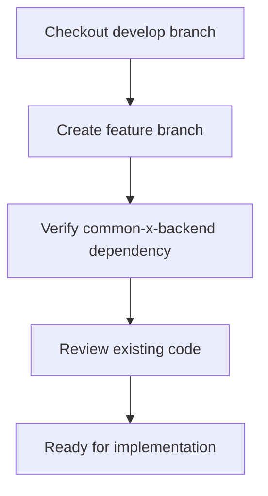
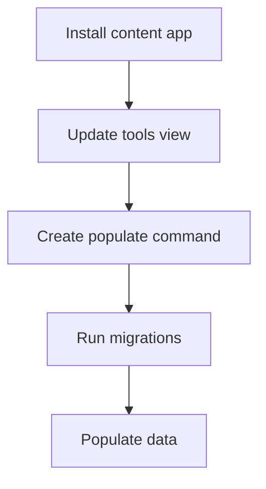
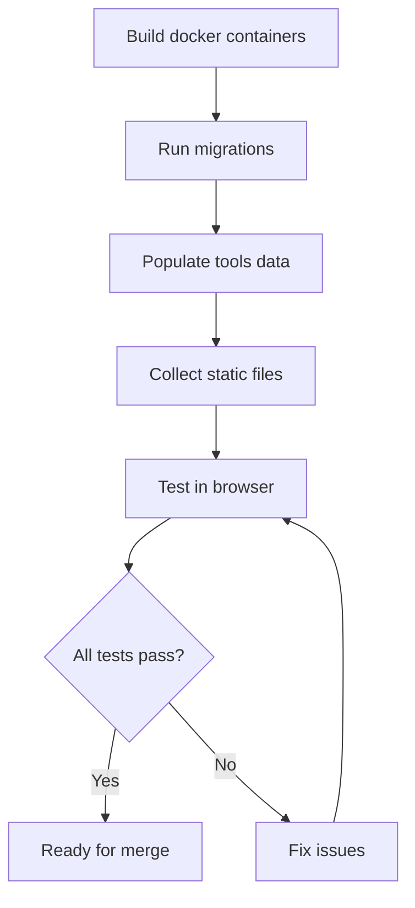

# Tools Feature Implementation Plan

## Executive Summary

This document outlines the plan to implement the tools page feature for the CommonRoad website, following the pattern from the tools-page branch while ensuring minimal changes to the production system.

---

## 1. Current State Analysis

### 1.1 What Exists (tools-page branch)

#### commonroad Repository

**Tools App:**
- [`commonroad/tools/views.py`](../commonroad/commonroad/tools/views.py) - Inherits from `BaseToolView`
- [`commonroad/tools/models.py`](../commonroad/commonroad/tools/models.py) - Empty (no models)
- [`commonroad/tools/urls.py`](../commonroad/commonroad/tools/urls.py) - Basic URL configuration
- [`commonroad/templates/commonroad/tools/tools.html`](../commonroad/commonroad/templates/commonroad/tools/tools.html) - Main tools page template

**Content App:**
- [`commonroad/content/models.py`](../commonroad/commonroad/content/models.py) - Contains Tool, Tutorial, News, ToolVideo, ToolLink, ToolPaper models
- [`commonroad/content/views.py`](../commonroad/commonroad/content/views.py) - REST API ViewSets
- [`commonroad/content/urls.py`](../commonroad/commonroad/content/urls.py) - REST API router
- **NOT INSTALLED** in [`INSTALLED_APPS`](../commonroad/commonroad/settings.py:52)

#### common-x-backend Repository

**Tools Module:**
- [`commonx/tools/views.py`](../common-x-backend/commonx/tools/views.py) - Contains `BaseToolView` (simple TemplateView)
- [`commonx/tools/templates/tools/tools.html`](../common-x-backend/commonx/tools/templates/tools/tools.html) - Base template

**Core Module:**
- [`commonx/core/templates/core/components/tool_card.html`](../common-x-backend/commonx/core/templates/core/components/tool_card.html) - Tool card component
- Other reusable components (card.html, button.html, code.html, box_tags.py)

### 1.2 What's Missing/Incomplete

1. **Content App Integration:**
   - `commonroad.content` is NOT in `INSTALLED_APPS`
   - No migrations for content models
   - No management command to populate tools data

2. **Tools View Logic:**
   - [`ToolView`](../commonroad/commonroad/tools/views.py:5) doesn't pass `tools` context variable
   - No query logic to fetch tools from database
   - No filtering or ordering logic

3. **Template Components:**
   - [`tools.html`](../commonroad/commonroad/templates/commonroad/tools/tools.html) references `tool_card.html` component
   - Component only exists in common-x-backend, not overridden in commonroad
   - Missing core components in commonroad (card.html, button.html, code.html)

4. **Individual Tool Pages:**
   - No URL patterns for individual tool pages (e.g., `/tools/commonroad-io`)
   - No view for individual tool details
   - No templates for individual tool pages

5. **Data Population:**
   - No management command to populate tools data
   - No sample tools in database

---

## 2. Architecture & Inheritance Pattern

### 2.1 Current Pattern

```
common-x-backend (commonx package)
├── commonx/tools/
│   ├── views.py (BaseToolView)
│   └── templates/tools/tools.html (base template)
└── commonx/core/
    └── templates/core/components/
        ├── tool_card.html
        ├── card.html
        ├── button.html
        └── code.html

commonroad (application)
├── commonroad/tools/
│   ├── views.py (ToolView inherits BaseToolView)
│   └── templates/commonroad/tools/tools.html (overrides base)
└── commonroad/content/
    └── models.py (Tool model with relationships)
```

### 2.2 Inheritance Flow

1. **View Inheritance:**
   - `ToolView` → `BaseToolView` → `TemplateView`
   - Allows overriding template and adding context data

2. **Template Inheritance:**
   - `commonroad/tools/tools.html` extends `core/base.html`
   - Uses `tool_card.html` component from common-x-backend
   - Can override components in commonroad if needed

3. **Model Independence:**
   - Tool model is in `commonroad.content` (not in common-x-backend)
   - Allows application-specific data models
   - common-x-backend provides reusable components only

---

## 3. Implementation Strategy

### 3.1 Branch Strategy

**Question:** Do we need a branch on common-x-backend?

**Answer:** **NO** - The current common-x-backend (develop branch) has all necessary components:
- `BaseToolView` in [`commonx/tools/views.py`](../common-x-backend/commonx/tools/views.py)
- `tool_card.html` component in [`commonx/core/templates/core/components/tool_card.html`](../common-x-backend/commonx/core/templates/core/components/tool_card.html)
- All other core components

**Plan:**
- Create branch ONLY on `commonroad` repository
- Use existing `common-x-backend` develop branch (or specific commit)
- Update [`pyproject.toml`](../commonroad/pyproject.toml:17) to use correct common-x-backend version if needed

### 3.2 Minimal Changes Approach

**Principle:** Make the smallest possible changes to get the feature working.

**Changes Required:**

1. **Install Content App** (1 file change)
   - Add `"commonroad.content"` to `INSTALLED_APPS` in [`settings.py`](../commonroad/commonroad/settings.py:52)

2. **Update Tools View** (1 file change)
   - Add `get_context_data()` method to [`ToolView`](../commonroad/commonroad/tools/views.py:5)
   - Query tools from database and add to context

3. **Create Management Command** (1 new file)
   - Create `commonroad/content/management/commands/populate_tools.py`
   - Populate sample tools data

4. **Run Migrations** (no file changes, just execution)
   - Run `uv run manage.py makemigrations`
   - Run `uv run manage.py migrate`

5. **Update pyproject.toml** (1 file change, if needed)
   - Update common-x-backend reference to develop branch

**Total Files Modified:** 3-4 files
**Total New Files:** 1 file

### 3.3 Docker Testing Strategy

**Steps:**
1. Create feature branch from develop
2. Make code changes
3. Run `docker compose up --build`
4. Enter container: `docker exec -it <CONTAINER_ID> /bin/sh`
5. Run migrations: `uv run manage.py migrate`
6. Populate data: `uv run manage.py populate_tools`
7. Collect static: `uv run manage.py collectstatic`
8. Test in browser at `http://localhost/tools/`

---

## 4. Detailed Implementation Plan

### Phase 1: Preparation



**Tasks:**
- [ ] Switch to `develop` branch in commonroad
- [ ] Create new feature branch: `feature/tools-page`
- [ ] Verify [`pyproject.toml`](../commonroad/pyproject.toml:17) references correct common-x-backend version
- [ ] Review existing tools implementation

### Phase 2: Core Implementation



**Task 1: Install Content App**
- File: [`commonroad/settings.py`](../commonroad/commonroad/settings.py:52)
- Change: Add `"commonroad.content"` to `INSTALLED_APPS`

**Task 2: Update Tools View**
- File: [`commonroad/tools/views.py`](../commonroad/commonroad/tools/views.py)
- Change: Add `get_context_data()` method to fetch tools
- Optional: Add ordering/filtering logic

**Task 3: Create Populate Command**
- File: `commonroad/content/management/commands/populate_tools.py` (new)
- Content: Create sample tools with tutorials, links, papers
- Follow pattern from [`add_dummy_data.py`](../commonroad/commonroad/scenarios/management/commands/add_dummy_data.py)

### Phase 3: Testing



**Tasks:**
- [ ] Run `docker compose up --build`
- [ ] Enter container
- [ ] Run `uv run manage.py makemigrations content`
- [ ] Run `uv run manage.py migrate`
- [ ] Run `uv run manage.py populate_tools`
- [ ] Run `uv run manage.py collectstatic`
- [ ] Test tools page at `http://localhost/tools/`
- [ ] Verify tool cards display correctly
- [ ] Verify navigation sidebar works
- [ ] Verify links/buttons work

### Phase 4: Merge & Verification

**Tasks:**
- [ ] Commit all changes
- [ ] Push to remote
- [ ] Create merge request
- [ ] Verify GitLab CI passes
- [ ] Merge to develop
- [ ] Test on develop branch
- [ ] Verify production compatibility

---

## 5. Implementation Details

### 5.1 Install Content App

**File:** [`commonroad/settings.py`](../commonroad/commonroad/settings.py:52)

```python
INSTALLED_APPS = [
    "django.contrib.admin",
    "django.contrib.auth",
    "django.contrib.contenttypes",
    "django.contrib.sessions",
    "django.contrib.messages",
    "django.contrib.staticfiles",
    "django.contrib.postgres",
    "django_filters",
    "storages",
    "commonx.core",
    "commonroad.content",  # ADD THIS LINE
    "commonroad.scenarios",
    "commonroad.tools",
]
```

### 5.2 Update Tools View

**File:** [`commonroad/tools/views.py`](../commonroad/commonroad/tools/views.py)

```python
from commonx.tools.views import BaseToolView
from commonroad.content.models import Tool


class ToolView(BaseToolView):
    """CommonRoad Tools page view."""
    template_name = "commonroad/tools/tools.html"
    model = Tool

    def get_context_data(self, **kwargs):
        context = super().get_context_data(**kwargs)
        # Fetch all tools, ordered by title
        context["tools"] = Tool.objects.all().order_by("title")
        return context
```

### 5.3 Create Populate Command

**File:** `commonroad/content/management/commands/populate_tools.py` (new)

```python
from django.core.management.base import BaseCommand
from commonroad.content.models import Tool, Tutorial, ToolLink, ToolPaper


class Command(BaseCommand):
    help = "Populate database with sample tools data"

    def handle(self, *args, **options):
        # Create sample tools
        # ... implementation similar to add_dummy_data.py
        self.stdout.write(self.style.SUCCESS("✓ Tools populated successfully"))
```

---

## 6. Risk Assessment

### 6.1 Low Risk Items

- Installing content app (standard Django pattern)
- Adding get_context_data() method (standard Django pattern)
- Creating management command (non-invasive)

### 6.2 Medium Risk Items

- Database migrations (need to test carefully)
- Template component dependencies (verify all components exist)

### 6.3 Mitigation Strategies

1. **Test in Docker first** - Isolated environment prevents production impact
2. **Minimal changes** - Only modify what's necessary
3. **Backwards compatible** - Don't break existing functionality
4. **Gradual rollout** - Test on develop before production

---

## 7. Success Criteria

### 7.1 Functional Requirements

- [ ] Tools page loads at `/tools/`
- [ ] Tool cards display correctly
- [ ] Navigation sidebar works
- [ ] Tool details display (title, description, tutorials, links)
- [ ] All links and buttons are functional

### 7.2 Technical Requirements

- [ ] No breaking changes to existing features
- [ ] All migrations apply successfully
- [ ] Docker containers run without errors
- [ ] GitLab CI pipeline passes
- [ ] Code follows existing patterns

### 7.3 Performance Requirements

- [ ] Page loads in < 2 seconds
- [ ] Database queries are optimized
- [ ] Static files load correctly

---

## 8. Open Questions

1. **Tool Data:** What tools should be included in the initial populate command?
   - CommonRoad-io
   - Drivability Checker
   - Reachable Set
   - CommonRoad Search
   - SUMO Interface
   - CommonRoad RL
   - Reactive Planner
   - Scenario Designer

2. **Tool Content:** Where will tool content (images, videos, papers) come from?
   - Use placeholder data for now
   - Add real content later via admin panel

3. **Individual Tool Pages:** Should we implement individual tool pages in this feature?
   - For now, focus on the main tools page
   - Individual pages can be a separate feature

4. **API Integration:** Should the tools page use the REST API or query models directly?
   - Query models directly (simpler, no API dependency)
   - REST API is available for external consumers

---

## 9. Timeline Estimate

| Phase | Tasks | Estimated Effort |
|-------|-------|------------------|
| Phase 1: Preparation | 4 tasks | 15 minutes |
| Phase 2: Implementation | 3 tasks | 45 minutes |
| Phase 3: Testing | 8 tasks | 30 minutes |
| Phase 4: Merge & Verify | 5 tasks | 15 minutes |
| **Total** | **20 tasks** | **~2 hours** |

---

## 10. Next Steps

1. **Review this plan** - Confirm approach and answer open questions
2. **Create feature branch** - `feature/tools-page` from `develop`
3. **Begin Phase 1** - Preparation tasks
4. **Implement Phase 2** - Core changes
5. **Test Phase 3** - Docker testing
6. **Complete Phase 4** - Merge and verify

---

## Appendix A: File Structure

```
commonroad/
├── commonroad/
│   ├── content/
│   │   ├── management/
│   │   │   └── commands/
│   │   │       └── populate_tools.py  [NEW]
│   │   ├── models.py
│   │   ├── views.py
│   │   └── urls.py
│   ├── settings.py  [MODIFY]
│   └── tools/
│       ├── views.py  [MODIFY]
│       └── templates/
│           └── commonroad/
│               └── tools/
│                   └── tools.html
└── pyproject.toml  [MAY MODIFY]

common-x-backend/  [NO CHANGES NEEDED]
└── commonx/
    ├── core/
    │   └── templates/
    │       └── core/
    │           └── components/
    │               ├── tool_card.html
    │               ├── card.html
    │               ├── button.html
    │               └── code.html
    └── tools/
        ├── views.py
        └── templates/
            └── tools/
                └── tools.html
```

---

## Appendix B: Testing Checklist

### Before Testing
- [ ] All code changes committed
- [ ] Docker containers stopped
- [ ] Feature branch pushed to remote

### During Testing
- [ ] `docker compose up --build` completes successfully
- [ ] Container is accessible
- [ ] Migrations run without errors
- [ ] Populate command completes
- [ ] Static files collected
- [ ] Tools page loads
- [ ] All tool cards display
- [ ] Navigation works
- [ ] No console errors

### After Testing
- [ ] All tests pass
- [ ] Screenshot taken (optional)
- [ ] Notes documented
- [ ] Ready for merge
